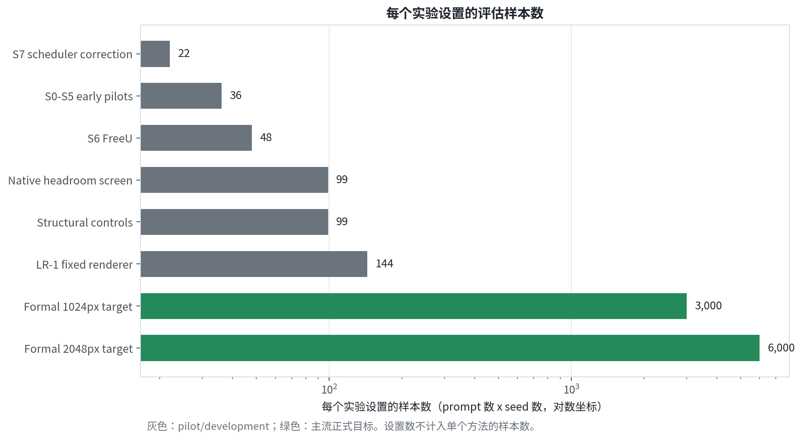
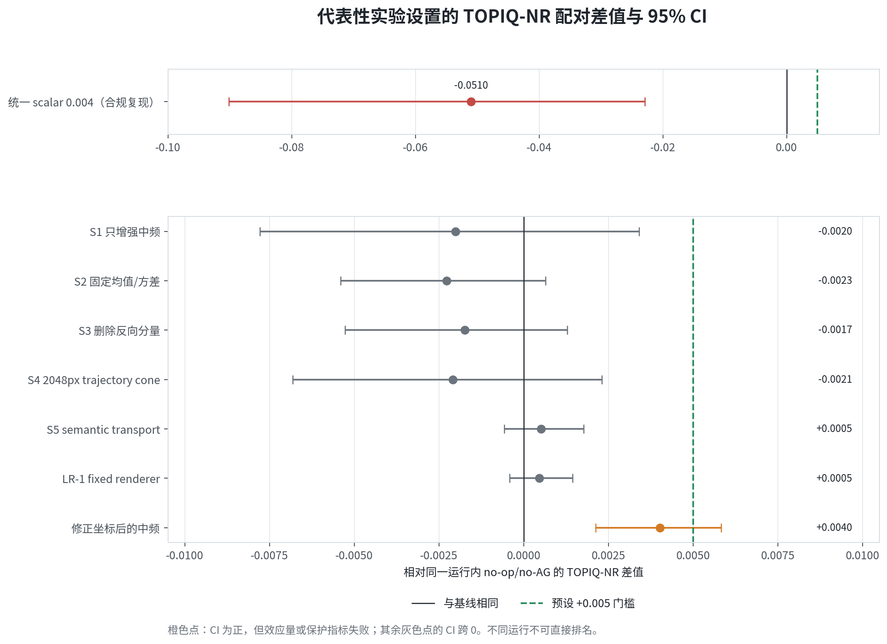
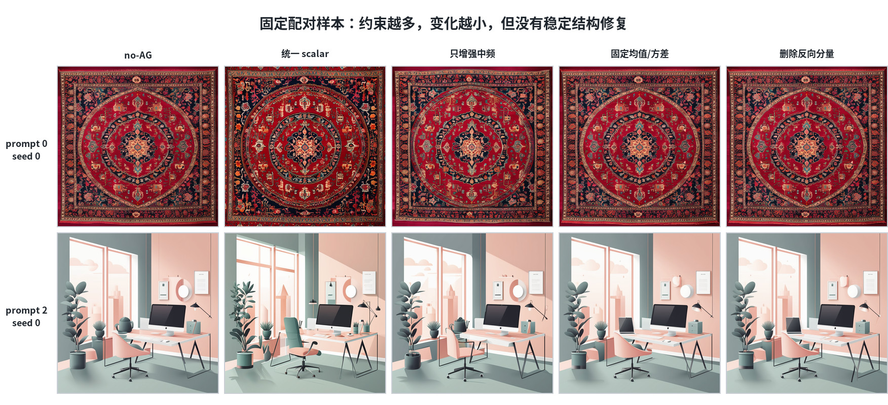
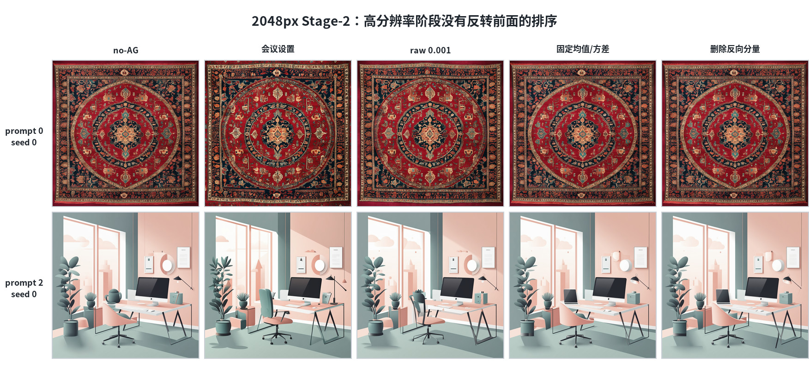
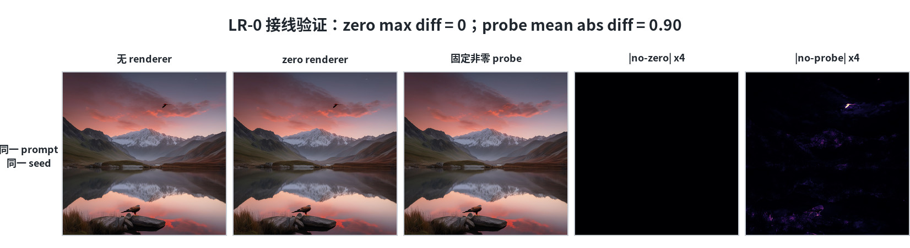
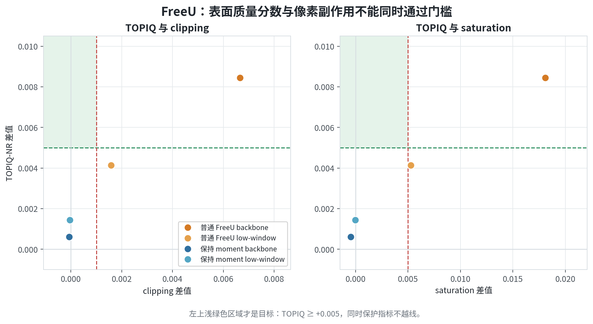
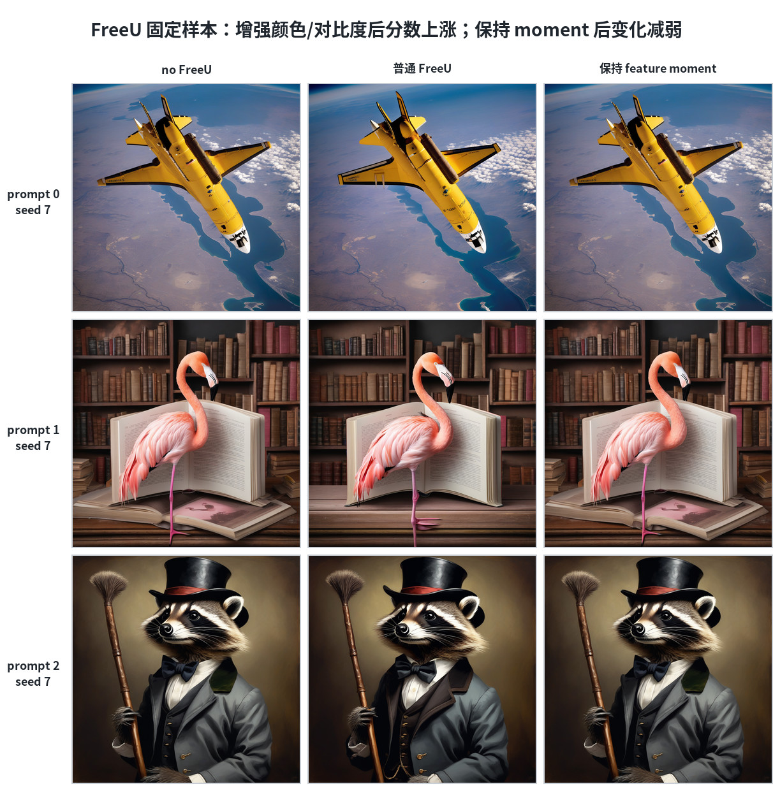
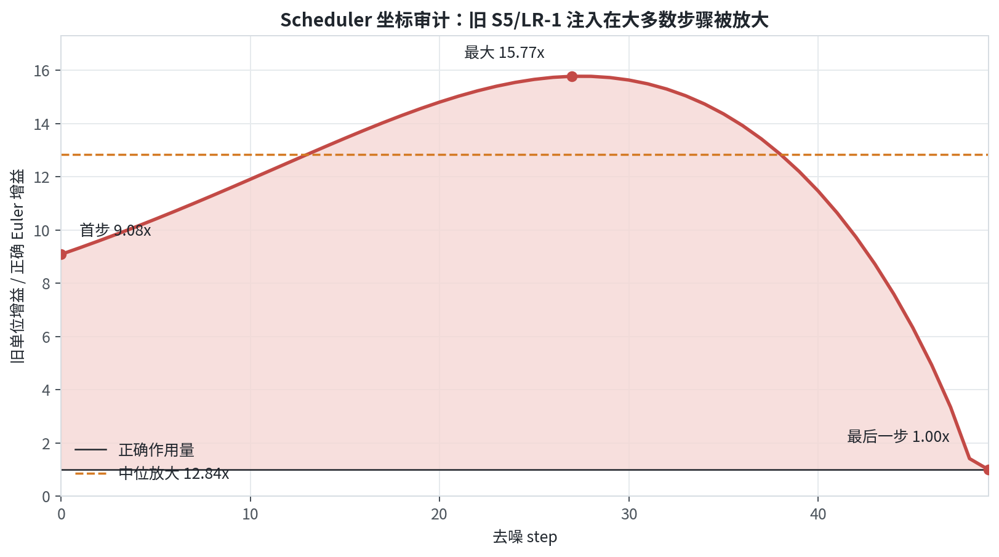

# 截至 2026-08-30 的实验结果

本文档把目前已经生成或完成审计的实验集中列出。`no_ag` 表示不使用
Attention Guidance 的基线；TOPIQ-NR 是图像质量指标，HPSv2 是文本与图像匹配的偏好指标，
两者一般都是越高越好。`clipping` 和 `saturation` 是保护指标，升高通常表示过曝或颜色过浓。
置信区间（CI）跨过 0 时，不能认为差异稳定。除非特别说明，以下都是 pilot 或 development，
不是最终论文 benchmark。正式评测应使用 1024px 的 1,000 prompts x 3 seeds（每个设置 3,000 张），
2048px 的 2,000 prompts x 3 seeds（每个设置 6,000 张），并让所有方法共享 prompt、seed、模型、VAE、
scheduler、CFG、NFE 和后处理。

## 可视化阅读指南



**图 1：每个实验设置实际评估了多少样本。** 这里统计的是 `prompt 数 x seed 数`，不再乘实验设置数。
现有结果最多为 LR-1 的 144 个样本/设置，仍远小于正式 1024px 的 3,000 个样本/设置和
2048px 的 6,000 个样本/设置，所以只能作为 pilot 或 development 证据。



**图 2：主要路线的 TOPIQ-NR 结果。** 圆点是相对各自运行内 `no_ag` 或 no-op 的平均差值，横线是
95% CI，绿色虚线是预设的 `+0.005` 门槛。统一 scalar 的点来自后续完整配对的 spectral pilot，
不使用第 1 节已作废的旧 sweep；它明显退化。后续约束把损伤逐渐减小，
但大多 CI 跨 0。修正 scheduler 坐标后的中频设置虽然为正，仍因效应量和 clipping 保护条件失败。
各实验的数据和设置不同，这张图只展示决策过程，不能用于跨实验排名。

## 1. 旧 scalar sweep（Exp-1.1）

**为什么做：** 先扫描会议版 Attention Guidance 的标量强度，寻找一个比论文设定更好的强度。

**观察：** 共 12 prompts x 3 seeds x 7 settings = 252 张图，但同一 prompt/seed 的实验设置分散到不同 GPU。

**结果：** 跨 GPU 破坏了严格配对，原先的配对 CI、显著性和排名都不能使用。

**结论：** 这轮只能作为早期探索，不能证明某个 scalar 有效，也不能用来训练 RL。

## 2. 频谱分配实验

**为什么做：** 检查只增强低频、中频或高频，是否比所有频率使用同一个 scalar 更好。

**观察：** 12 x 3 x 11 = 396 张图；实现能在等增益时退化为原 scalar。强 guidance 主要改变颜色、对比度和锐度。

**结果：** `mid-only 0.004` 的 TOPIQ-NR 差值为 `-0.002014`（CI `[-0.007778,+0.003404]`），只是损伤最小；
低频、高频和等增益设置更差。HPSv2 的小幅正差值都跨 0。

**结论：** 没有频带稳定优于 `no_ag`，G1 失败，频谱设置不进入 RL。

## 3. 幅度 follow-up

**为什么做：** 排除“方向其实有用，只是 `0.004` 太强”的解释。

**观察：** 12 x 3 x 10 = 360 张图；随着幅度变大，颜色饱和和 TOPIQ 损伤一起变重。

**结果：** `mid-only` 的 TOPIQ 差值从 scale `0.001` 的 `-0.000121` 逐步变为 scale `0.004` 的 `-0.002014`；
scalar 在 `0.001` 已是 `-0.001570`，在 `0.004` 为 `-0.051005`。

**结论：** 减小幅度只会回到 `no_ag`，没有中间最优点；问题不只是强度。

## 4. 内容自适应与 seed-CV

**为什么做：** 检查是否应让不同 prompt 选择不同实验设置，而不是使用一个全局设置。

**观察：** 复用前两轮数据做留一 seed 交叉验证，不新增独立图像；`no_ag` 始终在候选集中。

**结果：** 全局选择每个 fold 都选 `no_ag`。逐 prompt 选择没有提高 TOPIQ，频谱集的差值为
`-0.003802`，并使 clipping 增加 `+0.002629`、saturation 增加 `+0.020408`。

**结论：** 当前数据连一个偏乐观的自适应上界都没有通过，不支持 prompt-conditioned controller。

## 5. S2：固定均值和方差的 tangent 更新

**为什么做：** 原始 residual 可能靠改变 latent 均值、方差和颜色来“投机”得分；本轮只保留不改变这些统计量的空间更新。

**观察：** 12 x 3 x 10 = 360 张图。固定矩约束确实压低了 saturation；raw `0.001` 的 saturation 增量为 `+0.013449`，
tangent 系列接近 0。

**结果：** 最好的 mean-centered `0.001` 仍为 TOPIQ `-0.000946`；`tangent-rescaled 0.001` 为 `-0.003763`
（CI `[-0.005925,-0.001483]`，显著为负）。

**结论：** 约束生效但没有质量收益；去掉颜色捷径后，剩余方向没有 headroom，S2 关闭。

## 6. S3：轨迹锥更新

**为什么做：** 检查 tangent 更新中是否有一部分与 scheduler 的正常去噪方向相反。

**观察：** 12 x 3 x 9 = 324 张图；投影确实删掉了反向分量，且对照图可复现。

**结果：** `cone 0.002` 相对 `no_ag` 的 TOPIQ 为 `-0.001740`；相对同强度 plain tangent 只高 `+0.000528`
（CI `[-0.000412,+0.001596]`）。

**结论：** 删除反向分量没有带来可确认的改善，S3 关闭，不做更多 scale 搜索或 RL。



**图 3：S0-S3 的固定配对样本。** 两行分别固定 prompt 和 seed，只改变实验设置。统一 scalar
带来的颜色、对比度和构图变化最明显；中频、固定均值/方差和删除反向分量逐步减小了变化，
但没有稳定修复物体结构。这是固定样本的直观解释，不能替代整套数据的统计结果。

## 7. S4：2048px Stage-2 迁移

**为什么做：** 确认前面在 1024px 的负结果会不会被最终高分辨率阶段反转。

**观察：** 工程 smoke 证明 Stage-2 noise 可复现，2048px VAE 路径无设备错误；pilot 共 12 x 3 x 5 = 180 张最终图。

**结果：** `conference_settings`、raw、tangent、cone 的 TOPIQ 差值分别为 `-0.020052`、`-0.005907`、
`-0.002836`、`-0.002091`。cone 只是少伤害一些，仍低于 `no_ag`，CLIP 保护条件也失败。

**结论：** 高分辨率没有救回 Attention Guidance，S4 关闭。



**图 4：2048px Stage-2 的固定配对样本。** 会议设置和 raw 仍会明显改变颜色及构图；约束后的两个
设置更接近 `no_ag`，但没有显示稳定的结构修复。这与定量结论一致：它们只是减少损伤，没有反转排序。

## 8. S5：reciprocal semantic transport

**为什么做：** noisy latent 的点积可能缺少语义；改用 UNet self-attention 图和 scheduler 预测的 clean latent 做空间传输。

**观察：** 12 x 3 x 14 = 504 张图，传输、entropy、confidence 和 update ratio 记录完整；semantic graph 与 permuted graph 很接近。

**结果：** 最好的 reciprocal semantic 设置 TOPIQ 差值只有 `+0.000509`（CI `[-0.000571,+0.001771]`），
远低于预设 `+0.005` 门槛；固定拼图没有稳定的文字、计数或位置修复。

**结论：** 没有建立语义图的因果优势，S5 关闭。后续 scheduler 审计还发现其注入坐标有问题，旧结果不能支持 clean-`x0` 机制主张。

## 9. LR-0：latent renderer 接线 smoke

**为什么做：** 验证小型 latent renderer 能否接入冻结 SDXL，而不是先盲目训练网络。

**观察：** zero-renderer 与 no-renderer 的 PNG hash 完全一致；非零 probe 能改变输出；50 NFE 和 structural provider smoke 的
moment error 都很小，输出为有效 1024px RGB 图。

**结果：** 接线、scheduler 注入和数值诊断通过；没有质量评分，也没有训练 checkpoint。

**结论：** 这是 engineering-only 证据，只说明代码能工作，不能说明 renderer 有收益。



**图 5：LR-0 只验证接线。** no-renderer 和 zero-renderer 的最大像素差为 0；固定非零 probe 会改变
图像，右侧四倍增强的差分图显示变化位置。这证明 renderer 路径实际生效，但完全不能说明画质提高。

## 10. LR-1：首次固定 renderer 搜索（protocol-invalid）

**为什么做：** 在训练 renderer 或 RL 前，先看六个可解释 basis 的固定系数是否有静态 headroom。

**观察：** 48 x 3 x 10 = 1440 张图，工程记录完整，但误用了保留 seed `0,42,123`。

**结果：** 由于 seed 已暴露，选择过程不再公平；该 run 及其 `spectral_low_pos` 选择不能作为性能证据。

**结论：** 仅保留工程审计价值，标记 protocol-invalid，不进入 validation、蒸馏或 RL。

## 11. LR-1：合规固定 renderer 搜索

**为什么做：** 用未暴露的 train seeds `7,19,73`，重新检验固定 renderer 是否值得继续。

**观察：** 48 x 3 x 10 = 1440/1440，144 个 prompt/seed block 均完整；数值和 trust/moment guards 通过。

**结果：** 所有候选 HPSv2 CI 都跨 0，selector 返回 `no_ag`。描述性 TOPIQ 最好仅 `+0.000457`，CI
`[-0.000418,+0.001450]`。

**结论：** 没有静态训练信号，因此不生成 validation 配置，不训练 renderer，也不启动 RL。

## 12. S6：FreeU 结构 baseline 与 feature-moment 对照

**为什么做：** 借鉴 FreeU 的 UNet 结构调节，检查结构信息是否比 raw latent residual 更有用，同时排查指标投机。

**观察：** 两个 development run 各为 24 x 2 x 8 = 384 张图。普通 FreeU 让颜色、对比度、锐度和饱和度明显增强。

**结果：** 普通 backbone-only 的 TOPIQ 提升 `+0.008447`，但 clipping `+0.006656`、saturation `+0.018090`；
保持 feature moment 后 TOPIQ 只剩 `+0.000609`（CI 跨 0），保护指标回到接近 0。

**结论：** 表面分数提升主要来自颜色/对比度捷径，不是可靠结构收益。FreeU 保留为强 baseline 和反取巧对照，S6 不进入 RL。



**图 6：FreeU 的指标权衡。** 只有左上浅绿色区域同时满足 TOPIQ 和保护指标门槛。普通 FreeU 的
backbone 设置提高了 TOPIQ，但 clipping 和 saturation 都越线；保持 feature moment 后副作用回到接近
0，TOPIQ 提升也掉到门槛以下，因此四个点都不合格。



**图 7：FreeU 的前三个登记 prompt，固定 seed 7。** 普通 FreeU 更明显地改变亮度、颜色和对比度；
保持 feature moment 后图像重新接近 no-FreeU。这些样本用于说明统计中看到的趋势，不是人工挑选的赢家。

## 13. S7：ancestral correction development

**为什么做：** 改用 Euler scheduler 的 ancestral 状态，测试是否能得到更自然的随机轨迹修正。

**观察：** 11 x 2 x 7 = 154 张同卡配对图；drift 设置严重退化，stochastic correction 的 correction/update ratio 平均约
`2.289/3.250/3.984`，最大约 `5.062`。

**结果：** ancestral `.25/.50/.75` 的 TOPIQ 均值为 `+0.007299/+0.009080/+0.006077`，但所有 CI 跨 0，
并伴随 saturation 上升；selector 返回 `no_correction`。

**结论：** 正差值更像随机 sampler 变化，不是可归因的 correction 收益；S7 关闭，不进入 renderer 或 RL。

## 14. S7 matched-NFE scheduler attribution

**为什么做：** 用相同 NFE 的 Euler-Ancestral、DPM++ 和 UniPC，排除“scheduler 本身不同”这一混杂因素。

**观察：** 修复 provenance 后最终有效矩阵为 11 x 2 x 4 = 88 张图；早期 v1-v4 因 provenance 或竞态问题不计入统计。

**结果：** Euler-Ancestral 相对 no-correction 为 `+0.010171`（CI 跨 0），DPM++ 为 `-0.014917`，UniPC 为 `-0.009976`；
全局最小 Holm p 为 `0.146519`。

**结论：** 只能说明 sampler 之间有差异，不能说明 latent correction 有效；所有 scheduler 实验设置禁止用于方法选择。

## 15. CFG 对照

**为什么做：** 排除 CFG `7.5` 没调好、从而让新方法看起来有优势的替代解释。

**观察：** 12 x 3 x 5 = 180 张同卡配对图；审计和严格评分通过。

**结果：** 相对 CFG `7.5`，CFG `2.5` 和 `5.0` 的 TOPIQ 分别为 `-0.056278` 和 `-0.015090`（显著退化）；
CFG `10.0/15.0` 虽为正点估计 `+0.003251/+0.004252`，但 CI 跨 0、低于 `+0.005`，且保护指标失败。

**结论：** selector 冻结 CFG `7.5` 并返回 `null_route`；后续方法统一使用该设置。

## 16. scheduler-coordinate audit

**为什么做：** 检查 S5/LR-1 把 guided clean latent 注回 scheduler 的公式是否真的对应正确的 Euler 轨迹。

**观察：** 旧代码使用 `prev_sample + (guided_x0 - pred_original_sample)`，但正确的 clean-endpoint 增益应为
`1 - sigma_next / sigma`。

**结果：** 旧单位增益在首步约放大 `9.0839x`，全程中位约 `12.8398x`，最大约 `15.7706x`；只有最后一步才接近 1 倍。

**结论：** S5/LR-1 结果重标为 legacy post-step latent nudge；撤回 clean-`x0` 机制解释，旧图不能监督新的 renderer/RL。



**图 8：旧注入公式为什么需要撤回。** 红线是旧单位增益除以正确 Euler 增益。除最后一步外，旧路径
大多放大约 9-16 倍，中位数为 12.84 倍。因此旧图只能说明 legacy post-step nudge 的结果，不能当作
scheduler-native renderer 的训练数据。

## 17. scheduler-native fixed-headroom screen

**为什么做：** 修正坐标后，用固定的 scheduler-native 低/中/高频和 Laplacian 设置重新检查是否存在最基本的静态 headroom。

**观察：** 33 x 3 x 8 = 792/792，zero identity、逐步 ledger 和严格审计通过。

**结果：** low `-0.001154`、mid `+0.004027`（CI `[+0.002120,+0.005830]`，但低于 `+0.005` 且 clipping guard 失败）、
high `-0.004024`、Laplacian `-0.002463`。

**结论：** evaluator 返回 `null_route`；这组固定设置不能进入 validation、learned renderer、蒸馏或 RL。

## 18. structural controls baseline calibration

**为什么做：** 在同一 1024px、50 NFE、CFG 7.5 条件下，把会议版 TFSA、FreeU、PLADIS port 和 GAG port 放在同一矩阵中，校准结构 baseline。

**观察：** 33 x 3 x 8 = 792 张图，generation/scorer audit 通过；但 evaluator 明确限定为 `development_evidence_reporting_only`，不允许方法选择。

**结果：** 三个普通 FreeU 版本的 TOPIQ 点差约 `+0.01025/+0.01088/+0.01176`，同时 clipping 约增加
`+0.0768/+0.1723/+0.0746`，saturation 约增加 `+0.0677/+0.1285/+0.0824`；会议版 TFSA 的 TOPIQ 差值约 `-0.02509`。
PLADIS 的正差值是相对 CFG 5 的描述性比较，不能直接和 `no_ag` 的结果排名。

**结论：** FreeU 的分数上涨不能视为有效方法收益，PLADIS/GAG 也没有形成可发表的胜者。本轮只用于描述性 baseline 校准，不能授权 RL。

## 总结与当前决定

目前没有正式 RL、OPD 或 latent-renderer 训练结果。所有候选路线都出现以下两种情况之一：分数提高但伴随明显的颜色、对比度、锐度、clipping 或 saturation 副作用；或者副作用被压住后，质量提升同时消失。当前没有一个固定实验设置在已有数据上提供足够、可靠的静态 headroom。

因此，下一步不能靠调 reward、堆 controller 或直接训练 RL 来掩盖基础实验设置失败。若继续研究，必须先重新登记一个与 scheduler 坐标一致、方向来源实质不同的算子，在全新的 prompt-disjoint 数据上通过 `+0.005` TOPIQ、CI、HPSv2/CLIP 非劣和像素保护门槛；只有固定设置先通过，才有理由进入 renderer、蒸馏或 RL。以上小规模结果不能替代最终的 1,000/2,000 prompts x 3 seeds 主流 benchmark。

## 可视化复现

图 1 的样本数是脚本中列出的审计常量，依据是各节记录的 prompt 数 x seed 数；manifest 会逐项记录这些
数值及其计算依据。其余图由冻结的 CSV、JSON 和 PNG 生成。整个过程不重新运行模型，也不重新评分。

复现前需要保留 manifest 所列的本地 `outputs/` 输入，并安装 `fonts-noto-cjk`。这些实验输入按仓库规则
不纳入 Git，因此只有当前冻结工作目录或另行取得同一输入包后才能复现；缺少输入或字体时脚本会停止并报错。
在包含 NumPy、pandas、Matplotlib 和 Pillow 的评测环境中运行：

```bash
python results/make_visualizations.py
```

`results/figures/manifest.json` 记录了审计常量、字体和每个输入文件的 SHA-256，以及输出图片的 SHA-256 与尺寸。
